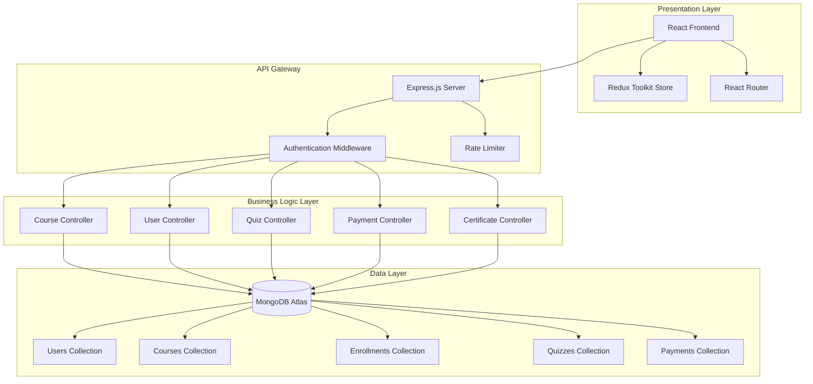
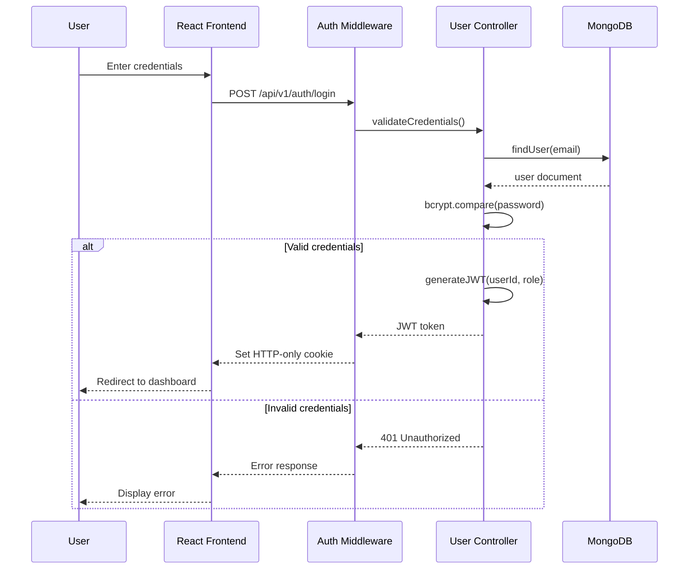
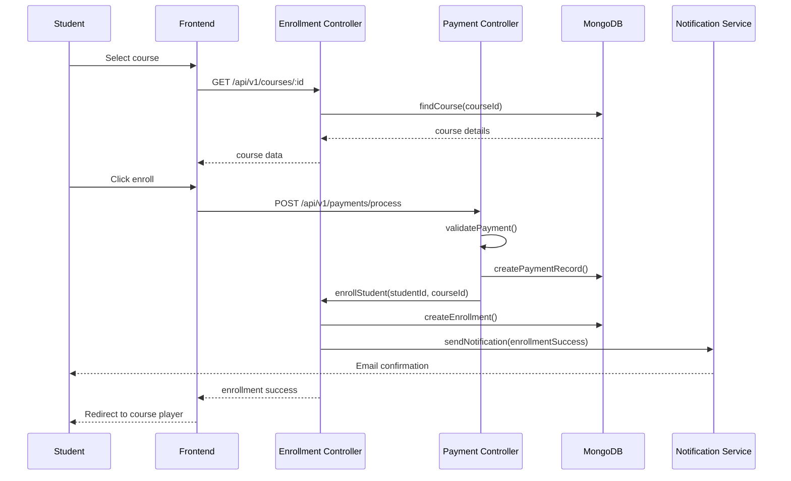

# Design Document: MERN Education Platform

## Overview

The MERN Education Platform is a comprehensive Learning Management System (LMS) built on the MongoDB, Express.js, React, and Node.js technology stack. The platform provides a scalable, cloud-based solution for online education with role-based access control supporting Students, Instructors, and Administrators. The system implements a three-tier architecture with a React frontend using Redux Toolkit for state management, an Express.js RESTful API backend following MVC patterns, and MongoDB Atlas for data persistence with replica sets for high availability. Core functionality includes course management with progress tracking, quiz and assessment systems, integrated payment processing, automated certificate generation, real-time notifications, and comprehensive analytics dashboards. The platform emphasizes security through JWT authentication, bcrypt password hashing, role-based access control, and implements performance optimizations including database indexing, pagination, lazy loading, and CDN integration for static assets.

## Architecture

The system follows a three-tier architecture pattern separating concerns across presentation, business logic, and data layers. The frontend React application communicates with the backend through a versioned RESTful API, while the backend interfaces with MongoDB Atlas for data persistence.



## Sequence Diagrams

### User Authentication Flow




### Course Enrollment and Progress Tracking Flow



## Components and Interfaces

### Component 1: Authentication Service

**Purpose**: Handles user authentication, authorization, and session management using JWT tokens


**Interface**:
```typescript
interface IAuthService {
  register(userData: RegisterDTO): Promise<AuthResponse>;
  login(credentials: LoginDTO): Promise<AuthResponse>;
  logout(userId: string): Promise<void>;
  verifyToken(token: string): Promise<TokenPayload>;
  refreshToken(refreshToken: string): Promise<AuthResponse>;
  resetPassword(email: string): Promise<void>;
  changePassword(userId: string, oldPassword: string, newPassword: string): Promise<void>;
  approveInstructor(instructorId: string, adminId: string): Promise<User>;
  rejectInstructor(instructorId: string, adminId: string, reason: string): Promise<void>;
  getPendingInstructors(): Promise<User[]>;
}

interface RegisterDTO {
  email: string;
  password: string;
  firstName: string;
  lastName: string;
  role: UserRole;
}

interface LoginDTO {
  email: string;
  password: string;
}

interface AuthResponse {
  success: boolean;
  token?: string;
  refreshToken?: string;
  user?: UserProfile;
  error?: string;
}

interface TokenPayload {
  userId: string;
  email: string;
  role: UserRole;
  iat: number;
  exp: number;
}
```

**Responsibilities**:
- Validate user credentials against database
- Generate and verify JWT tokens with expiration
- Hash passwords using bcrypt with salt rounds
- Manage HTTP-only cookie sessions
- Implement refresh token rotation
- Handle password reset workflows
- Manage instructor approval workflow
- Verify instructor approval status before login
- Track admin approval actions


### Component 2: Course Management Service

**Purpose**: Manages course lifecycle including creation, updates, module organization, content delivery, and file attachments

**Interface**:
```typescript
interface ICourseService {
  createCourse(courseData: CreateCourseDTO, instructorId: string): Promise<Course>;
  updateCourse(courseId: string, updates: UpdateCourseDTO): Promise<Course>;
  deleteCourse(courseId: string): Promise<void>;
  getCourse(courseId: string): Promise<Course>;
  listCourses(filters: CourseFilters, pagination: PaginationParams): Promise<PaginatedResult<Course>>;
  addModule(courseId: string, moduleData: ModuleDTO): Promise<Module>;
  updateModule(moduleId: string, updates: ModuleDTO): Promise<Module>;
  deleteModule(moduleId: string): Promise<void>;
  addLesson(moduleId: string, lessonData: LessonDTO): Promise<Lesson>;
  uploadAttachment(lessonId: string, file: File): Promise<Attachment>;
  deleteAttachment(attachmentId: string): Promise<void>;
  downloadAttachment(attachmentId: string, studentId: string): Promise<string>;
  publishCourse(courseId: string): Promise<Course>;
  unpublishCourse(courseId: string): Promise<Course>;
}

interface CreateCourseDTO {
  title: string;
  description: string;
  category: string;
  level: CourseLevel;
  price: number;
  thumbnail: string;
  prerequisites: string[];
  learningObjectives: string[];
}

interface Course {
  _id: string;
  title: string;
  description: string;
  instructorId: string;
  category: string;
  level: CourseLevel;
  price: number;
  thumbnail: string;
  modules: Module[];
  prerequisites: string[];
  learningObjectives: string[];
  isPublished: boolean;
  enrollmentCount: number;
  rating: number;
  createdAt: Date;
  updatedAt: Date;
}
```


**Responsibilities**:
- Validate course data and business rules
- Manage course publishing workflow
- Handle module and lesson hierarchy
- Enforce instructor ownership permissions
- Implement course search and filtering
- Track enrollment statistics
- Handle file uploads (PDF, PPT, Word, Excel, etc.)
- Manage file access control (only enrolled students can download)
- Validate file types and sizes

### Component 3: Enrollment Service

**Purpose**: Manages student enrollments, progress tracking, and course completion

**Interface**:
```typescript
interface IEnrollmentService {
  enrollStudent(studentId: string, courseId: string, paymentId: string): Promise<Enrollment>;
  unenrollStudent(enrollmentId: string): Promise<void>;
  getEnrollment(enrollmentId: string): Promise<Enrollment>;
  getStudentEnrollments(studentId: string): Promise<Enrollment[]>;
  getCourseEnrollments(courseId: string): Promise<Enrollment[]>;
  updateProgress(enrollmentId: string, lessonId: string, completed: boolean): Promise<Enrollment>;
  calculateProgress(enrollmentId: string): Promise<number>;
  checkCompletion(enrollmentId: string): Promise<boolean>;
  getEnrollmentStats(courseId: string): Promise<EnrollmentStats>;
}

interface Enrollment {
  _id: string;
  studentId: string;
  courseId: string;
  paymentId: string;
  enrolledAt: Date;
  progress: LessonProgress[];
  completionPercentage: number;
  isCompleted: boolean;
  completedAt?: Date;
  certificateId?: string;
  lastAccessedAt: Date;
}

interface LessonProgress {
  lessonId: string;
  completed: boolean;
  completedAt?: Date;
  timeSpent: number;
}
```


**Responsibilities**:
- Create enrollment records after payment verification
- Track lesson completion status
- Calculate real-time progress percentages
- Trigger certificate generation on completion
- Maintain last accessed timestamps
- Generate enrollment analytics

### Component 4: Quiz and Assessment Service

**Purpose**: Manages quiz creation, administration, grading, and result tracking

**Interface**:
```typescript
interface IQuizService {
  createQuiz(quizData: CreateQuizDTO, courseId: string): Promise<Quiz>;
  updateQuiz(quizId: string, updates: UpdateQuizDTO): Promise<Quiz>;
  deleteQuiz(quizId: string): Promise<void>;
  getQuiz(quizId: string): Promise<Quiz>;
  addQuestion(quizId: string, question: QuestionDTO): Promise<Question>;
  submitQuiz(attemptData: QuizAttemptDTO): Promise<QuizResult>;
  gradeQuiz(attemptId: string): Promise<QuizResult>;
  getQuizResults(studentId: string, quizId: string): Promise<QuizResult[]>;
  getQuizStatistics(quizId: string): Promise<QuizStatistics>;
}

interface Quiz {
  _id: string;
  courseId: string;
  moduleId: string;
  title: string;
  description: string;
  questions: Question[];
  duration: number;
  passingScore: number;
  maxAttempts: number;
  isPublished: boolean;
  createdAt: Date;
}

interface Question {
  _id: string;
  type: QuestionType;
  text: string;
  options: string[];
  correctAnswer: string | string[];
  points: number;
  explanation?: string;
}
```


interface QuizAttemptDTO {
  studentId: string;
  quizId: string;
  answers: QuizAnswer[];
  startedAt: Date;
  submittedAt: Date;
}

interface QuizResult {
  _id: string;
  studentId: string;
  quizId: string;
  answers: QuizAnswer[];
  score: number;
  percentage: number;
  passed: boolean;
  attemptNumber: number;
  submittedAt: Date;
  gradedAt: Date;
}
```

**Responsibilities**:
- Validate quiz structure and question formats
- Enforce time limits and attempt restrictions
- Auto-grade objective questions
- Calculate scores and percentages
- Track attempt history
- Generate quiz analytics

### Component 5: Payment Service

**Purpose**: Handles payment processing, transaction tracking, and refund management

**Interface**:
```typescript
interface IPaymentService {
  processPayment(paymentData: PaymentDTO): Promise<PaymentResult>;
  verifyPayment(paymentId: string): Promise<boolean>;
  getPayment(paymentId: string): Promise<Payment>;
  getUserPayments(userId: string): Promise<Payment[]>;
  initiateRefund(paymentId: string, reason: string): Promise<RefundResult>;
  getPaymentStatistics(filters: PaymentFilters): Promise<PaymentStatistics>;
}
```


interface PaymentDTO {
  userId: string;
  courseId: string;
  amount: number;
  currency: string; // Supports: USD, EUR, ETB (Ethiopian Birr)
  paymentMethod: PaymentMethod;
  paymentToken: string;
  phoneNumber?: string; // Required for Ethiopian mobile payment methods
}

interface Payment {
  _id: string;
  userId: string;
  courseId: string;
  amount: number;
  currency: string;
  paymentMethod: PaymentMethod;
  status: PaymentStatus;
  transactionId: string;
  createdAt: Date;
  completedAt?: Date;
}

interface PaymentResult {
  success: boolean;
  paymentId?: string;
  transactionId?: string;
  error?: string;
}
```

**Responsibilities**:
- Integrate with payment gateway APIs
- Validate payment amounts and currency
- Store transaction records securely
- Handle payment failures and retries
- Process refund requests
- Generate revenue reports

### Component 6: Certificate Service

**Purpose**: Generates, stores, and verifies course completion certificates

**Interface**:
```typescript
interface ICertificateService {
  generateCertificate(enrollmentId: string): Promise<Certificate>;
  getCertificate(certificateId: string): Promise<Certificate>;
  verifyCertificate(certificateId: string, verificationCode: string): Promise<boolean>;
  getUserCertificates(userId: string): Promise<Certificate[]>;
  regenerateCertificate(certificateId: string): Promise<Certificate>;
}
```


interface Certificate {
  _id: string;
  enrollmentId: string;
  studentId: string;
  courseId: string;
  studentName: string;
  courseTitle: string;
  completionDate: Date;
  verificationCode: string;
  certificateUrl: string;
  issuedAt: Date;
}
```

**Responsibilities**:
- Generate PDF certificates with unique verification codes
- Store certificates in cloud storage
- Implement verification system
- Track certificate issuance
- Handle certificate regeneration requests

## Data Models

### Model 1: User

```typescript
interface User {
  _id: string;
  email: string;
  passwordHash: string;
  firstName: string;
  lastName: string;
  role: UserRole;
  profile: UserProfile;
  isActive: boolean;
  isEmailVerified: boolean;
  isApproved: boolean; // For instructor approval by admin
  approvedBy?: string; // Admin user ID who approved
  approvedAt?: Date;
  lastLoginAt?: Date;
  createdAt: Date;
  updatedAt: Date;
}

enum UserRole {
  STUDENT = 'student',
  INSTRUCTOR = 'instructor',
  ADMIN = 'admin'
}

interface UserProfile {
  avatar?: string;
  bio?: string;
  phone?: string;
  dateOfBirth?: Date;
  address?: Address;
  socialLinks?: SocialLinks;
}
```


**Validation Rules**:
- email: Must be valid email format, unique in collection
- passwordHash: Must be bcrypt hash with minimum 10 salt rounds
- firstName, lastName: Required, 2-50 characters, alphabetic
- role: Must be one of UserRole enum values
- isActive: Defaults to true
- isEmailVerified: Defaults to false
- isApproved: Defaults to true for students/admins, false for instructors
- Instructors cannot login until isApproved === true

**Indexes**:
- email: unique index
- role: non-unique index for role-based queries
- createdAt: descending index for sorting

### Model 2: Course

```typescript
interface Course {
  _id: string;
  title: string;
  description: string;
  instructorId: string;
  category: string;
  level: CourseLevel;
  price: number;
  thumbnail: string;
  modules: Module[];
  prerequisites: string[];
  learningObjectives: string[];
  isPublished: boolean;
  enrollmentCount: number;
  rating: number;
  reviewCount: number;
  createdAt: Date;
  updatedAt: Date;
}

enum CourseLevel {
  BEGINNER = 'beginner',
  INTERMEDIATE = 'intermediate',
  ADVANCED = 'advanced'
}

interface Module {
  _id: string;
  title: string;
  description: string;
  order: number;
  lessons: Lesson[];
}

interface Lesson {
  _id: string;
  title: string;
  description: string;
  type: LessonType;
  content: string;
  videoUrl?: string;
  duration: number;
  order: number;
  resources: Resource[];
  attachments: Attachment[]; // PDF, PPT, Word, etc.
}

interface Attachment {
  _id: string;
  fileName: string;
  fileType: string; // pdf, ppt, pptx, doc, docx, xls, xlsx, txt
  fileSize: number; // in bytes
  fileUrl: string; // Cloud storage URL
  uploadedAt: Date;
  isDownloadable: boolean;
}
```


**Validation Rules**:
- title: Required, 5-200 characters, unique per instructor
- description: Required, 50-5000 characters
- instructorId: Must reference valid User with instructor role
- price: Non-negative number, maximum 99999.99
- level: Must be one of CourseLevel enum values
- modules: Array with at least 1 module for published courses
- isPublished: Defaults to false
- enrollmentCount: Non-negative integer, defaults to 0
- rating: 0-5 range, defaults to 0

**Indexes**:
- instructorId: non-unique index
- category: non-unique index
- isPublished: non-unique index
- rating: descending index
- Compound index: (category, level, isPublished)

### Model 3: Enrollment

```typescript
interface Enrollment {
  _id: string;
  studentId: string;
  courseId: string;
  paymentId: string;
  enrolledAt: Date;
  progress: LessonProgress[];
  completionPercentage: number;
  isCompleted: boolean;
  completedAt?: Date;
  certificateId?: string;
  lastAccessedAt: Date;
}

interface LessonProgress {
  lessonId: string;
  completed: boolean;
  completedAt?: Date;
  timeSpent: number;
}
```

**Validation Rules**:
- studentId: Must reference valid User with student role
- courseId: Must reference valid published Course
- paymentId: Must reference valid completed Payment
- Unique compound index on (studentId, courseId) to prevent duplicate enrollments
- completionPercentage: 0-100 range
- isCompleted: Auto-set to true when completionPercentage reaches 100


**Indexes**:
- Compound unique index: (studentId, courseId)
- studentId: non-unique index
- courseId: non-unique index
- isCompleted: non-unique index

### Model 4: Quiz

```typescript
interface Quiz {
  _id: string;
  courseId: string;
  moduleId: string;
  title: string;
  description: string;
  questions: Question[];
  duration: number;
  passingScore: number;
  maxAttempts: number;
  isPublished: boolean;
  createdAt: Date;
  updatedAt: Date;
}

interface Question {
  _id: string;
  type: QuestionType;
  text: string;
  options: string[];
  correctAnswer: string | string[];
  points: number;
  explanation?: string;
}

enum QuestionType {
  MULTIPLE_CHOICE = 'multiple_choice',
  TRUE_FALSE = 'true_false',
  MULTI_SELECT = 'multi_select',
  SHORT_ANSWER = 'short_answer'
}
```

**Validation Rules**:
- courseId: Must reference valid Course
- title: Required, 5-200 characters
- questions: Array with at least 1 question
- duration: Positive integer (minutes), maximum 300
- passingScore: 0-100 range
- maxAttempts: Positive integer, maximum 10
- Question points: Positive number
- Multiple choice options: Array with 2-6 items


### Model 5: Payment

```typescript
interface Payment {
  _id: string;
  userId: string;
  courseId: string;
  amount: number;
  currency: string;
  paymentMethod: PaymentMethod;
  status: PaymentStatus;
  transactionId: string;
  metadata: PaymentMetadata;
  createdAt: Date;
  completedAt?: Date;
  refundedAt?: Date;
}

enum PaymentMethod {
  CREDIT_CARD = 'credit_card',
  DEBIT_CARD = 'debit_card',
  PAYPAL = 'paypal',
  STRIPE = 'stripe',
  TELEBIRR = 'telebirr',
  CBE_BIRR = 'cbe_birr',
  CBE = 'cbe',
  AWASH_BANK = 'awash_bank',
  SIINQEE_BANK = 'siinqee_bank'
}

enum PaymentStatus {
  PENDING = 'pending',
  COMPLETED = 'completed',
  FAILED = 'failed',
  REFUNDED = 'refunded'
}

interface PaymentMetadata {
  ipAddress: string;
  userAgent: string;
  gatewayResponse?: any;
}
```

**Validation Rules**:
- userId: Must reference valid User
- courseId: Must reference valid Course
- amount: Positive number matching course price
- currency: ISO 4217 currency code (USD, EUR, ETB for Ethiopian Birr)
- status: Must be one of PaymentStatus enum values
- transactionId: Unique identifier from payment gateway
- phoneNumber: Required for Ethiopian mobile payment methods (Telebirr, CBE Birr)

**Indexes**:
- userId: non-unique index
- courseId: non-unique index
- status: non-unique index
- transactionId: unique index
- createdAt: descending index


### Model 6: Certificate

```typescript
interface Certificate {
  _id: string;
  enrollmentId: string;
  studentId: string;
  courseId: string;
  studentName: string;
  courseTitle: string;
  instructorName: string;
  completionDate: Date;
  verificationCode: string;
  certificateUrl: string;
  issuedAt: Date;
}
```

**Validation Rules**:
- enrollmentId: Must reference valid completed Enrollment
- studentId: Must reference valid User
- courseId: Must reference valid Course
- verificationCode: Unique 16-character alphanumeric code
- certificateUrl: Valid HTTPS URL to PDF in cloud storage

**Indexes**:
- enrollmentId: unique index
- studentId: non-unique index
- verificationCode: unique index

### Model 7: Notification

```typescript
interface Notification {
  _id: string;
  userId: string;
  type: NotificationType;
  title: string;
  message: string;
  data?: any;
  isRead: boolean;
  createdAt: Date;
  readAt?: Date;
}

enum NotificationType {
  ENROLLMENT = 'enrollment',
  COURSE_UPDATE = 'course_update',
  QUIZ_GRADED = 'quiz_graded',
  CERTIFICATE_ISSUED = 'certificate_issued',
  PAYMENT_SUCCESS = 'payment_success',
  PAYMENT_FAILED = 'payment_failed',
  SYSTEM = 'system'
}
```


**Validation Rules**:
- userId: Must reference valid User
- type: Must be one of NotificationType enum values
- title: Required, 5-100 characters
- message: Required, 10-500 characters
- isRead: Defaults to false

**Indexes**:
- userId: non-unique index
- isRead: non-unique index
- createdAt: descending index
- Compound index: (userId, isRead, createdAt)

## Algorithmic Pseudocode

### Main Processing Algorithm: User Authentication

```typescript
async function authenticateUser(credentials: LoginDTO): Promise<AuthResponse> {
  // INPUT: credentials containing email and password
  // OUTPUT: AuthResponse with token or error
  // PRECONDITION: credentials.email is valid email format
  // PRECONDITION: credentials.password is non-empty string
  // POSTCONDITION: Returns valid JWT token if authentication succeeds
  // POSTCONDITION: Returns error message if authentication fails
  // POSTCONDITION: No side effects on user data if authentication fails
  
  // Step 1: Validate input format
  if (!isValidEmail(credentials.email)) {
    return { success: false, error: "Invalid email format" };
  }
  
  if (credentials.password.length < 8) {
    return { success: false, error: "Invalid credentials" };
  }
  
  // Step 2: Find user in database
  const user = await User.findOne({ email: credentials.email });
  
  if (!user) {
    // Use generic error to prevent user enumeration
    return { success: false, error: "Invalid credentials" };
  }
  
  // Step 3: Check if account is active
  if (!user.isActive) {
    return { success: false, error: "Account is deactivated" };
  }
  
  // Step 3.5: Check if instructor is approved
  if (user.role === UserRole.INSTRUCTOR && !user.isApproved) {
    return { success: false, error: "Account pending admin approval" };
  }
  
  // Step 4: Verify password using bcrypt
  const isPasswordValid = await bcrypt.compare(
    credentials.password,
    user.passwordHash
  );
  
  if (!isPasswordValid) {
    return { success: false, error: "Invalid credentials" };
  }

  
  // Step 5: Generate JWT token
  const tokenPayload: TokenPayload = {
    userId: user._id,
    email: user.email,
    role: user.role,
    iat: Math.floor(Date.now() / 1000),
    exp: Math.floor(Date.now() / 1000) + (24 * 60 * 60) // 24 hours
  };
  
  const token = jwt.sign(tokenPayload, process.env.JWT_SECRET);
  const refreshToken = jwt.sign(
    { userId: user._id },
    process.env.REFRESH_TOKEN_SECRET,
    { expiresIn: '7d' }
  );
  
  // Step 6: Update last login timestamp
  await User.updateOne(
    { _id: user._id },
    { lastLoginAt: new Date() }
  );
  
  // Step 7: Return success response
  return {
    success: true,
    token,
    refreshToken,
    user: {
      id: user._id,
      email: user.email,
      firstName: user.firstName,
      lastName: user.lastName,
      role: user.role
    }
  };
}
```

**Preconditions**:
- credentials parameter is defined and contains email and password fields
- Database connection is established and User model is available
- JWT_SECRET and REFRESH_TOKEN_SECRET environment variables are set
- bcrypt library is available for password comparison
- If user is instructor, isApproved must be true

**Postconditions**:
- Returns AuthResponse object with success boolean
- If successful: token and refreshToken are valid JWT strings
- If successful: user.lastLoginAt is updated in database
- If failed: error message is descriptive but doesn't reveal sensitive info
- No password hashes are exposed in response
- Instructors with isApproved === false cannot login


**Loop Invariants**: N/A (no loops in this algorithm)

### Progress Calculation Algorithm

```typescript
async function calculateEnrollmentProgress(enrollmentId: string): Promise<number> {
  // INPUT: enrollmentId - unique identifier for enrollment
  // OUTPUT: completionPercentage - number between 0 and 100
  // PRECONDITION: enrollmentId references valid Enrollment document
  // PRECONDITION: Enrollment has valid courseId reference
  // POSTCONDITION: Returns percentage as integer 0-100
  // POSTCONDITION: Percentage reflects ratio of completed lessons to total lessons
  // POSTCONDITION: Enrollment document is updated with new percentage
  
  // Step 1: Fetch enrollment with course data
  const enrollment = await Enrollment.findById(enrollmentId)
    .populate('courseId');
  
  if (!enrollment) {
    throw new Error('Enrollment not found');
  }
  
  // Step 2: Extract all lessons from course modules
  const course = enrollment.courseId as Course;
  const allLessons: string[] = [];
  
  for (const module of course.modules) {
    // LOOP INVARIANT: allLessons contains all lesson IDs from processed modules
    for (const lesson of module.lessons) {
      // LOOP INVARIANT: All previously added lesson IDs are valid
      allLessons.push(lesson._id);
    }
  }
  
  const totalLessons = allLessons.length;
  
  if (totalLessons === 0) {
    return 0;
  }
  
  // Step 3: Count completed lessons
  let completedCount = 0;
  
  for (const lessonProgress of enrollment.progress) {
    // LOOP INVARIANT: completedCount <= number of processed progress entries
    // LOOP INVARIANT: completedCount >= 0
    if (lessonProgress.completed) {
      completedCount++;
    }
  }
  
  // Step 4: Calculate percentage
  const percentage = Math.floor((completedCount / totalLessons) * 100);
  
  // Step 5: Update enrollment document
  await Enrollment.updateOne(
    { _id: enrollmentId },
    { 
      completionPercentage: percentage,
      isCompleted: percentage === 100,
      completedAt: percentage === 100 ? new Date() : undefined
    }
  );
  
  return percentage;
}
```


**Preconditions**:
- enrollmentId is a valid MongoDB ObjectId string
- Referenced Enrollment document exists in database
- Enrollment.courseId references a valid Course document
- Course has at least one module with lessons (or returns 0)

**Postconditions**:
- Returns integer between 0 and 100 inclusive
- Enrollment.completionPercentage is updated in database
- If percentage is 100: isCompleted is set to true and completedAt is set
- If percentage < 100: isCompleted remains false
- Calculation is accurate: (completed lessons / total lessons) * 100

**Loop Invariants**:
- Outer loop (modules): allLessons contains all lesson IDs from previously processed modules
- Inner loop (lessons): All lesson IDs added to allLessons are valid strings
- Progress loop: completedCount is non-negative and <= number of processed entries

### Quiz Grading Algorithm

```typescript
async function gradeQuizAttempt(attemptData: QuizAttemptDTO): Promise<QuizResult> {
  // INPUT: attemptData containing studentId, quizId, answers, timestamps
  // OUTPUT: QuizResult with score, percentage, and pass/fail status
  // PRECONDITION: attemptData.quizId references valid Quiz document
  // PRECONDITION: attemptData.answers array length matches quiz questions count
  // PRECONDITION: Student has not exceeded maxAttempts for this quiz
  // POSTCONDITION: Returns QuizResult with accurate score calculation
  // POSTCONDITION: QuizResult is persisted to database
  // POSTCONDITION: Student's attempt count is incremented
  
  // Step 1: Fetch quiz with questions
  const quiz = await Quiz.findById(attemptData.quizId);
  
  if (!quiz) {
    throw new Error('Quiz not found');
  }
  
  // Step 2: Validate attempt eligibility
  const previousAttempts = await QuizResult.countDocuments({
    studentId: attemptData.studentId,
    quizId: attemptData.quizId
  });
  
  if (previousAttempts >= quiz.maxAttempts) {
    throw new Error('Maximum attempts exceeded');
  }
  
  // Step 3: Validate time limit
  const timeSpent = attemptData.submittedAt.getTime() - attemptData.startedAt.getTime();
  const timeLimitMs = quiz.duration * 60 * 1000;
  
  if (timeSpent > timeLimitMs) {
    throw new Error('Time limit exceeded');
  }

  
  // Step 4: Grade each answer
  let totalScore = 0;
  let maxScore = 0;
  const gradedAnswers: QuizAnswer[] = [];
  
  for (let i = 0; i < quiz.questions.length; i++) {
    // LOOP INVARIANT: totalScore >= 0
    // LOOP INVARIANT: maxScore equals sum of points from processed questions
    // LOOP INVARIANT: gradedAnswers.length === i
    
    const question = quiz.questions[i];
    const studentAnswer = attemptData.answers[i];
    
    maxScore += question.points;
    
    let isCorrect = false;
    
    if (question.type === QuestionType.MULTIPLE_CHOICE || 
        question.type === QuestionType.TRUE_FALSE) {
      isCorrect = studentAnswer.answer === question.correctAnswer;
    } else if (question.type === QuestionType.MULTI_SELECT) {
      const correctSet = new Set(question.correctAnswer as string[]);
      const answerSet = new Set(studentAnswer.answer as string[]);
      isCorrect = setsAreEqual(correctSet, answerSet);
    }
    
    if (isCorrect) {
      totalScore += question.points;
    }
    
    gradedAnswers.push({
      questionId: question._id,
      answer: studentAnswer.answer,
      isCorrect,
      pointsEarned: isCorrect ? question.points : 0
    });
  }
  
  // Step 5: Calculate percentage and pass/fail
  const percentage = (totalScore / maxScore) * 100;
  const passed = percentage >= quiz.passingScore;
  
  // Step 6: Create and save result
  const result = new QuizResult({
    studentId: attemptData.studentId,
    quizId: attemptData.quizId,
    answers: gradedAnswers,
    score: totalScore,
    percentage,
    passed,
    attemptNumber: previousAttempts + 1,
    submittedAt: attemptData.submittedAt,
    gradedAt: new Date()
  });
  
  await result.save();
  
  return result;
}
```


**Preconditions**:
- attemptData.quizId references existing Quiz document
- attemptData.answers.length equals quiz.questions.length
- attemptData.studentId references valid User with student role
- Student has not exceeded quiz.maxAttempts
- Time between startedAt and submittedAt <= quiz.duration

**Postconditions**:
- Returns QuizResult object with all required fields populated
- result.score is sum of points from correct answers
- result.percentage is accurate: (score / maxScore) * 100
- result.passed is true if and only if percentage >= quiz.passingScore
- QuizResult document is persisted to database
- result.attemptNumber equals previous attempts + 1

**Loop Invariants**:
- totalScore is non-negative throughout iteration
- maxScore equals sum of question.points for all processed questions
- gradedAnswers.length equals number of processed questions
- All entries in gradedAnswers have valid questionId references

## Key Functions with Formal Specifications

### Function 1: enrollStudent()

```typescript
async function enrollStudent(
  studentId: string,
  courseId: string,
  paymentId: string
): Promise<Enrollment>
```

**Preconditions:**
- studentId references valid User document with role === 'student'
- courseId references valid Course document with isPublished === true
- paymentId references valid Payment document with status === 'completed'
- Payment.amount matches Course.price
- No existing Enrollment with same (studentId, courseId) pair
- Payment.userId equals studentId
- Payment.courseId equals courseId

**Postconditions:**
- Returns Enrollment object with _id field populated
- Enrollment document is persisted to database
- enrollment.completionPercentage === 0
- enrollment.isCompleted === false
- enrollment.progress is empty array
- Course.enrollmentCount is incremented by 1
- Notification is created for student
- No side effects if any precondition fails (transaction rollback)


**Loop Invariants:** N/A

### Function 2: updateLessonProgress()

```typescript
async function updateLessonProgress(
  enrollmentId: string,
  lessonId: string,
  completed: boolean
): Promise<Enrollment>
```

**Preconditions:**
- enrollmentId references valid Enrollment document
- lessonId references valid Lesson within enrolled Course
- Enrollment.isCompleted === false (cannot update completed courses)
- User making request is the enrolled student or admin

**Postconditions:**
- Returns updated Enrollment object
- If completed === true and lesson not previously completed:
  - New LessonProgress entry added to enrollment.progress
  - enrollment.completionPercentage is recalculated
  - enrollment.lastAccessedAt is updated to current timestamp
- If completed === false:
  - Existing LessonProgress entry is updated
  - enrollment.completionPercentage is recalculated
- If all lessons completed:
  - enrollment.isCompleted === true
  - enrollment.completedAt is set to current timestamp
  - Certificate generation is triggered asynchronously
- Enrollment document is persisted with updates

**Loop Invariants:** 
- During progress recalculation: All processed lesson progress entries are valid

### Function 3: processPayment()

```typescript
async function processPayment(paymentData: PaymentDTO): Promise<PaymentResult>
```

**Preconditions:**
- paymentData.userId references valid User document
- paymentData.courseId references valid Course document
- paymentData.amount equals Course.price
- paymentData.paymentToken is valid token from payment gateway
- User has not already enrolled in the course
- Payment gateway API is accessible


**Postconditions:**
- Returns PaymentResult with success boolean
- If successful:
  - Payment document created with status === 'completed'
  - result.paymentId and result.transactionId are populated
  - Payment gateway has processed transaction
  - User can proceed to enrollment
- If failed:
  - Payment document created with status === 'failed'
  - result.error contains descriptive message
  - No charges applied to user's payment method
  - Gateway failure reason is logged
- Payment metadata includes IP address and user agent
- Idempotency: Duplicate payment tokens are rejected

**Loop Invariants:** N/A

### Function 4: generateCertificate()

```typescript
async function generateCertificate(enrollmentId: string): Promise<Certificate>
```

**Preconditions:**
- enrollmentId references valid Enrollment document
- enrollment.isCompleted === true
- enrollment.completionPercentage === 100
- No existing Certificate for this enrollmentId
- Course and User documents referenced by enrollment exist
- PDF generation service is available
- Cloud storage service is accessible

**Postconditions:**
- Returns Certificate object with all fields populated
- Certificate document is persisted to database
- PDF file is generated with student name, course title, completion date
- PDF is uploaded to cloud storage
- certificate.certificateUrl is valid HTTPS URL
- certificate.verificationCode is unique 16-character alphanumeric string
- Notification is sent to student
- Certificate can be verified using verificationCode
- Operation is idempotent: Subsequent calls return existing certificate

**Loop Invariants:** N/A


### Function 5: verifyToken()

```typescript
async function verifyToken(token: string): Promise<TokenPayload>
```

**Preconditions:**
- token is non-empty string
- JWT_SECRET environment variable is set
- token was generated by this system

**Postconditions:**
- Returns TokenPayload if token is valid and not expired
- Throws error if token is invalid, malformed, or expired
- payload.userId references existing User document
- payload.role matches User's current role in database
- No side effects on database
- Verification is stateless (no database queries for token validation)

**Loop Invariants:** N/A

## Example Usage

### Example 1: Complete User Registration and Course Enrollment Flow

```typescript
// Step 1: Register new student
const registerData: RegisterDTO = {
  email: "student@example.com",
  password: "SecurePass123!",
  firstName: "John",
  lastName: "Doe",
  role: UserRole.STUDENT
};

const authResponse = await authService.register(registerData);

if (!authResponse.success) {
  console.error(authResponse.error);
  return;
}

// Step 2: Login
const loginData: LoginDTO = {
  email: "student@example.com",
  password: "SecurePass123!"
};

const loginResponse = await authService.login(loginData);
const token = loginResponse.token;

// Step 3: Browse and select course
const courses = await courseService.listCourses(
  { category: "Programming", level: CourseLevel.BEGINNER },
  { page: 1, limit: 10 }
);

const selectedCourse = courses.data[0];


// Step 4: Process payment
const paymentData: PaymentDTO = {
  userId: authResponse.user.id,
  courseId: selectedCourse._id,
  amount: selectedCourse.price,
  currency: "USD",
  paymentMethod: PaymentMethod.STRIPE,
  paymentToken: "tok_visa_12345" // From Stripe.js
};

const paymentResult = await paymentService.processPayment(paymentData);

if (!paymentResult.success) {
  console.error(paymentResult.error);
  return;
}

// Step 5: Enroll in course
const enrollment = await enrollmentService.enrollStudent(
  authResponse.user.id,
  selectedCourse._id,
  paymentResult.paymentId
);

console.log(`Enrolled successfully! Progress: ${enrollment.completionPercentage}%`);
```

### Example 2: Course Progress Tracking

```typescript
// Student completes a lesson
const enrollment = await enrollmentService.getEnrollment(enrollmentId);
const firstLesson = enrollment.courseId.modules[0].lessons[0];

// Mark lesson as completed
const updatedEnrollment = await enrollmentService.updateProgress(
  enrollmentId,
  firstLesson._id,
  true
);

console.log(`Progress: ${updatedEnrollment.completionPercentage}%`);

// Check if course is completed
if (updatedEnrollment.isCompleted) {
  console.log("Course completed! Certificate will be generated.");
  
  // Certificate is auto-generated, retrieve it
  const certificate = await certificateService.getCertificate(
    updatedEnrollment.certificateId
  );
  
  console.log(`Certificate URL: ${certificate.certificateUrl}`);
  console.log(`Verification Code: ${certificate.verificationCode}`);
}
```


### Example 3: Quiz Taking and Grading

```typescript
// Student starts a quiz
const quiz = await quizService.getQuiz(quizId);
const startTime = new Date();

// Student answers questions
const answers: QuizAnswer[] = [
  { questionId: quiz.questions[0]._id, answer: "A" },
  { questionId: quiz.questions[1]._id, answer: "true" },
  { questionId: quiz.questions[2]._id, answer: ["A", "C"] }
];

// Submit quiz
const attemptData: QuizAttemptDTO = {
  studentId: userId,
  quizId: quiz._id,
  answers,
  startedAt: startTime,
  submittedAt: new Date()
};

const result = await quizService.submitQuiz(attemptData);

console.log(`Score: ${result.score}/${result.percentage}%`);
console.log(`Status: ${result.passed ? "PASSED" : "FAILED"}`);
console.log(`Attempt: ${result.attemptNumber}/${quiz.maxAttempts}`);

// View results
if (result.passed) {
  console.log("Congratulations! You passed the quiz.");
} else {
  const remainingAttempts = quiz.maxAttempts - result.attemptNumber;
  console.log(`You can retry. Remaining attempts: ${remainingAttempts}`);
}
```

### Example 4: Instructor Creating a Course

```typescript
// Instructor creates a new course
const courseData: CreateCourseDTO = {
  title: "Introduction to TypeScript",
  description: "Learn TypeScript from scratch with hands-on examples",
  category: "Programming",
  level: CourseLevel.BEGINNER,
  price: 49.99,
  thumbnail: "https://cdn.example.com/thumbnails/typescript.jpg",
  prerequisites: ["Basic JavaScript knowledge"],
  learningObjectives: [
    "Understand TypeScript type system",
    "Build type-safe applications",
    "Use advanced TypeScript features"
  ]
};

const course = await courseService.createCourse(courseData, instructorId);


// Add module to course
const moduleData: ModuleDTO = {
  title: "Getting Started with TypeScript",
  description: "Introduction to TypeScript basics",
  order: 1,
  lessons: []
};

const module = await courseService.addModule(course._id, moduleData);

// Add lesson to module
const lessonData: LessonDTO = {
  title: "What is TypeScript?",
  description: "Understanding TypeScript and its benefits",
  type: LessonType.VIDEO,
  content: "TypeScript is a typed superset of JavaScript...",
  videoUrl: "https://cdn.example.com/videos/lesson1.mp4",
  duration: 15,
  order: 1,
  resources: [
    { title: "TypeScript Handbook", url: "https://typescriptlang.org/docs" }
  ]
};

const lesson = await courseService.addLesson(module._id, lessonData);

// Publish course
const publishedCourse = await courseService.publishCourse(course._id);
console.log(`Course published: ${publishedCourse.title}`);
```

### Example 5: Admin Analytics Dashboard

```typescript
// Get platform-wide statistics
const userStats = await User.aggregate([
  { $group: { _id: "$role", count: { $sum: 1 } } }
]);

const enrollmentStats = await Enrollment.aggregate([
  {
    $group: {
      _id: null,
      totalEnrollments: { $sum: 1 },
      completedCourses: {
        $sum: { $cond: ["$isCompleted", 1, 0] }
      },
      averageProgress: { $avg: "$completionPercentage" }
    }
  }
]);

const revenueStats = await Payment.aggregate([
  { $match: { status: PaymentStatus.COMPLETED } },
  {
    $group: {
      _id: null,
      totalRevenue: { $sum: "$amount" },
      transactionCount: { $sum: 1 }
    }
  }
]);

console.log("Platform Statistics:");
console.log(`Total Users: ${userStats}`);
console.log(`Total Enrollments: ${enrollmentStats[0].totalEnrollments}`);
console.log(`Completion Rate: ${(enrollmentStats[0].completedCourses / enrollmentStats[0].totalEnrollments * 100).toFixed(2)}%`);
console.log(`Total Revenue: $${revenueStats[0].totalRevenue.toFixed(2)}`);
```


## Correctness Properties

### Property 1: Authentication Security

```typescript
// Universal quantification: For all authentication attempts
∀ credentials ∈ LoginDTO:
  authenticateUser(credentials).success === true ⟹
    ∃ user ∈ Users: (
      user.email === credentials.email ∧
      bcrypt.compare(credentials.password, user.passwordHash) === true ∧
      user.isActive === true
    )

// No user enumeration: Failed attempts don't reveal whether user exists
∀ credentials ∈ LoginDTO:
  ¬∃ user ∈ Users: user.email === credentials.email ⟹
    authenticateUser(credentials).error === "Invalid credentials"
  
  ∃ user ∈ Users: (user.email === credentials.email ∧ 
                    bcrypt.compare(credentials.password, user.passwordHash) === false) ⟹
    authenticateUser(credentials).error === "Invalid credentials"
```

### Property 2: Enrollment Integrity

```typescript
// No duplicate enrollments
∀ e1, e2 ∈ Enrollments:
  e1._id ≠ e2._id ⟹
    ¬(e1.studentId === e2.studentId ∧ e1.courseId === e2.courseId)

// Enrollment requires completed payment
∀ enrollment ∈ Enrollments:
  ∃ payment ∈ Payments: (
    payment._id === enrollment.paymentId ∧
    payment.status === PaymentStatus.COMPLETED ∧
    payment.userId === enrollment.studentId ∧
    payment.courseId === enrollment.courseId
  )

// Progress is monotonically increasing
∀ enrollment ∈ Enrollments, ∀ updates to enrollment:
  enrollment.completionPercentage_new ≥ enrollment.completionPercentage_old
```


### Property 3: Progress Calculation Accuracy

```typescript
// Progress percentage is accurate
∀ enrollment ∈ Enrollments:
  let totalLessons = count(lessons in enrollment.courseId.modules)
  let completedLessons = count(lp ∈ enrollment.progress where lp.completed === true)
  
  enrollment.completionPercentage === floor((completedLessons / totalLessons) * 100)

// Completion status consistency
∀ enrollment ∈ Enrollments:
  enrollment.isCompleted === true ⟺ enrollment.completionPercentage === 100

// Certificate generation on completion
∀ enrollment ∈ Enrollments:
  enrollment.isCompleted === true ⟹
    ∃ certificate ∈ Certificates: certificate.enrollmentId === enrollment._id
```

### Property 4: Quiz Grading Correctness

```typescript
// Score calculation is accurate
∀ result ∈ QuizResults:
  let quiz = Quizzes.findById(result.quizId)
  let totalPoints = sum(q.points for q in quiz.questions)
  let earnedPoints = sum(a.pointsEarned for a in result.answers)
  
  result.score === earnedPoints ∧
  result.percentage === (earnedPoints / totalPoints) * 100

// Pass/fail determination
∀ result ∈ QuizResults:
  let quiz = Quizzes.findById(result.quizId)
  result.passed === true ⟺ result.percentage ≥ quiz.passingScore

// Attempt limit enforcement
∀ student ∈ Users, ∀ quiz ∈ Quizzes:
  let attempts = count(r ∈ QuizResults where r.studentId === student._id ∧ r.quizId === quiz._id)
  attempts ≤ quiz.maxAttempts
```

### Property 5: Payment Integrity

```typescript
// Payment amount matches course price
∀ payment ∈ Payments where payment.status === PaymentStatus.COMPLETED:
  let course = Courses.findById(payment.courseId)
  payment.amount === course.price

// No enrollment without payment
∀ enrollment ∈ Enrollments:
  ∃ payment ∈ Payments: (
    payment._id === enrollment.paymentId ∧
    payment.status === PaymentStatus.COMPLETED
  )

// Transaction ID uniqueness
∀ p1, p2 ∈ Payments:
  p1._id ≠ p2._id ⟹ p1.transactionId ≠ p2.transactionId
```


### Property 6: Role-Based Access Control

```typescript
// Students can only access their own enrollments
∀ request to getEnrollment(enrollmentId) by user with role === UserRole.STUDENT:
  let enrollment = Enrollments.findById(enrollmentId)
  request.userId === enrollment.studentId ∨ request is denied

// Instructors can only modify their own courses
∀ request to updateCourse(courseId) by user with role === UserRole.INSTRUCTOR:
  let course = Courses.findById(courseId)
  request.userId === course.instructorId ∨ request is denied

// Only completed payments create enrollments
∀ enrollment ∈ Enrollments:
  let payment = Payments.findById(enrollment.paymentId)
  payment.status === PaymentStatus.COMPLETED
```

### Property 7: Certificate Verification

```typescript
// Verification codes are unique
∀ c1, c2 ∈ Certificates:
  c1._id ≠ c2._id ⟹ c1.verificationCode ≠ c2.verificationCode

// Certificate validity
∀ certificate ∈ Certificates:
  verifyCertificate(certificate._id, certificate.verificationCode) === true

// One certificate per enrollment
∀ e1, e2 ∈ Enrollments where e1._id ≠ e2._id:
  e1.certificateId ≠ e2.certificateId ∨ 
  e1.certificateId === undefined ∨ 
  e2.certificateId === undefined
```

## Error Handling

### Error Scenario 1: Invalid Authentication

**Condition**: User provides incorrect email or password
**Response**: Return 401 Unauthorized with generic error message "Invalid credentials"
**Recovery**: User can retry with correct credentials; implement rate limiting after 5 failed attempts
**Logging**: Log failed attempt with IP address and timestamp (do not log password)

### Error Scenario 2: Payment Processing Failure

**Condition**: Payment gateway returns error or timeout
**Response**: Create Payment record with status 'failed', return error to user
**Recovery**: User can retry payment; previous failed attempts don't block retry
**Logging**: Log full gateway response, transaction ID, and error details
**Notification**: Send email to user about failed payment with retry instructions


### Error Scenario 3: Duplicate Enrollment Attempt

**Condition**: Student tries to enroll in course they're already enrolled in
**Response**: Return 409 Conflict with message "Already enrolled in this course"
**Recovery**: Redirect user to course player with existing enrollment
**Logging**: Log attempt with user ID and course ID
**Prevention**: Frontend should check enrollment status before showing payment option

### Error Scenario 4: Quiz Time Limit Exceeded

**Condition**: Student submits quiz after duration expires
**Response**: Return 400 Bad Request with message "Time limit exceeded"
**Recovery**: Quiz is not graded; attempt is not counted; student can retry if attempts remain
**Logging**: Log submission time, start time, and time limit
**Frontend**: Implement client-side timer with auto-submit at time limit

### Error Scenario 5: Database Connection Failure

**Condition**: MongoDB connection is lost or times out
**Response**: Return 503 Service Unavailable with message "Service temporarily unavailable"
**Recovery**: Implement automatic reconnection with exponential backoff; retry failed operations
**Logging**: Log connection errors with full stack trace
**Monitoring**: Alert operations team if connection failures exceed threshold

### Error Scenario 6: Certificate Generation Failure

**Condition**: PDF generation service or cloud storage is unavailable
**Response**: Log error but don't block enrollment completion
**Recovery**: Implement retry queue; attempt certificate generation every 5 minutes until successful
**Logging**: Log full error details and enrollment ID
**Notification**: Notify student when certificate becomes available

### Error Scenario 7: Invalid JWT Token

**Condition**: Token is expired, malformed, or signed with wrong secret
**Response**: Return 401 Unauthorized with message "Invalid or expired token"
**Recovery**: Frontend redirects to login page; user must re-authenticate
**Logging**: Log token validation failure (do not log token itself)
**Security**: Implement token refresh mechanism to minimize re-authentication


### Error Scenario 8: Course Not Found

**Condition**: User requests course that doesn't exist or was deleted
**Response**: Return 404 Not Found with message "Course not found"
**Recovery**: Redirect user to course catalog
**Logging**: Log requested course ID and user ID
**Prevention**: Implement soft delete for courses to maintain enrollment history

## Testing Strategy

### Unit Testing Approach

**Framework**: Jest with TypeScript support

**Coverage Goals**: Minimum 80% code coverage for business logic, 90% for critical paths (authentication, payment, enrollment)

**Key Test Suites**:

1. **Authentication Service Tests**
   - Valid login with correct credentials
   - Failed login with incorrect password
   - Failed login with non-existent user
   - Account deactivation handling
   - JWT token generation and verification
   - Password hashing with bcrypt
   - Token expiration handling
   - Refresh token rotation

2. **Course Service Tests**
   - Course creation with valid data
   - Course creation validation failures
   - Module and lesson hierarchy management
   - Course publishing workflow
   - Instructor ownership verification
   - Course search and filtering
   - Pagination functionality

3. **Enrollment Service Tests**
   - Successful enrollment after payment
   - Duplicate enrollment prevention
   - Progress calculation accuracy
   - Lesson completion tracking
   - Course completion detection
   - Certificate trigger on completion

4. **Quiz Service Tests**
   - Quiz creation and validation
   - Answer grading for all question types
   - Score calculation accuracy
   - Pass/fail determination
   - Attempt limit enforcement
   - Time limit validation

5. **Payment Service Tests**
   - Successful payment processing
   - Payment gateway integration mocking
   - Failed payment handling
   - Amount validation
   - Transaction ID uniqueness
   - Refund processing


**Mocking Strategy**:
- Mock MongoDB with mongodb-memory-server for isolated tests
- Mock payment gateway API calls with jest.mock()
- Mock email service for notification tests
- Mock cloud storage for certificate upload tests

**Test Data Management**:
- Use factory functions to generate test data
- Implement database seeding for integration tests
- Clean up test data after each test suite

### Property-Based Testing Approach

**Framework**: fast-check for TypeScript

**Property Test Library**: fast-check

**Key Properties to Test**:

1. **Progress Calculation Properties**
   - Property: Progress percentage is always between 0 and 100
   - Property: Completing all lessons results in 100% progress
   - Property: Progress is monotonically increasing
   - Generator: Random enrollment states with varying lesson completion

2. **Quiz Grading Properties**
   - Property: Score is always between 0 and maximum possible score
   - Property: Percentage equals (score / maxScore) * 100
   - Property: All correct answers yield 100% score
   - Property: All incorrect answers yield 0% score
   - Generator: Random quiz structures with varying question types

3. **Authentication Properties**
   - Property: Valid credentials always produce valid JWT token
   - Property: Token verification succeeds for all generated tokens
   - Property: Expired tokens always fail verification
   - Generator: Random user credentials and token payloads

4. **Enrollment Properties**
   - Property: No two enrollments have same (studentId, courseId) pair
   - Property: All enrollments have corresponding completed payment
   - Property: Enrollment count matches number of enrollment records
   - Generator: Random enrollment scenarios

5. **Payment Properties**
   - Property: Payment amount always matches course price
   - Property: Transaction IDs are unique across all payments
   - Property: Completed payments have non-null completedAt timestamp
   - Generator: Random payment scenarios with various amounts


**Example Property Test**:

```typescript
import fc from 'fast-check';

describe('Progress Calculation Properties', () => {
  it('should always return percentage between 0 and 100', () => {
    fc.assert(
      fc.property(
        fc.array(fc.boolean()), // Random array of completion statuses
        (completionStatuses) => {
          const totalLessons = completionStatuses.length;
          if (totalLessons === 0) return true;
          
          const completedCount = completionStatuses.filter(c => c).length;
          const percentage = Math.floor((completedCount / totalLessons) * 100);
          
          return percentage >= 0 && percentage <= 100;
        }
      )
    );
  });
  
  it('should return 100% when all lessons are completed', () => {
    fc.assert(
      fc.property(
        fc.integer({ min: 1, max: 100 }), // Random number of lessons
        (lessonCount) => {
          const allCompleted = new Array(lessonCount).fill(true);
          const completedCount = allCompleted.filter(c => c).length;
          const percentage = Math.floor((completedCount / lessonCount) * 100);
          
          return percentage === 100;
        }
      )
    );
  });
});
```

### Integration Testing Approach

**Framework**: Jest with Supertest for API testing

**Test Environment**: Separate test database with MongoDB Atlas test cluster

**Key Integration Test Scenarios**:

1. **End-to-End Enrollment Flow**
   - Register user → Login → Browse courses → Process payment → Enroll → Verify enrollment
   - Verify database state at each step
   - Test rollback on payment failure

2. **Course Completion Flow**
   - Enroll in course → Complete all lessons → Verify progress updates → Check certificate generation
   - Test notification delivery
   - Verify certificate accessibility

3. **Quiz Taking Flow**
   - Access quiz → Submit answers → Receive graded results → Retry if failed
   - Test attempt limit enforcement
   - Verify result persistence


4. **Authentication and Authorization Flow**
   - Register → Verify email → Login → Access protected routes → Token refresh → Logout
   - Test role-based access control
   - Verify token expiration handling

5. **Payment and Refund Flow**
   - Process payment → Verify transaction → Request refund → Verify refund status
   - Test payment gateway integration
   - Verify enrollment status after refund

**API Testing Example**:

```typescript
import request from 'supertest';
import app from '../app';

describe('Enrollment Integration Tests', () => {
  let authToken: string;
  let courseId: string;
  let paymentId: string;
  
  beforeAll(async () => {
    // Setup: Create test user and course
    const registerResponse = await request(app)
      .post('/api/v1/auth/register')
      .send({
        email: 'test@example.com',
        password: 'Test123!',
        firstName: 'Test',
        lastName: 'User',
        role: 'student'
      });
    
    authToken = registerResponse.body.token;
    
    // Create test course as instructor
    // ... course creation logic
  });
  
  it('should complete full enrollment flow', async () => {
    // Step 1: Process payment
    const paymentResponse = await request(app)
      .post('/api/v1/payments/process')
      .set('Authorization', `Bearer ${authToken}`)
      .send({
        courseId,
        amount: 49.99,
        currency: 'USD',
        paymentMethod: 'stripe',
        paymentToken: 'tok_test'
      });
    
    expect(paymentResponse.status).toBe(200);
    expect(paymentResponse.body.success).toBe(true);
    paymentId = paymentResponse.body.paymentId;
    
    // Step 2: Enroll in course
    const enrollResponse = await request(app)
      .post('/api/v1/enrollments')
      .set('Authorization', `Bearer ${authToken}`)
      .send({
        courseId,
        paymentId
      });
    
    expect(enrollResponse.status).toBe(201);
    expect(enrollResponse.body.completionPercentage).toBe(0);
    expect(enrollResponse.body.isCompleted).toBe(false);
  });
});
```


## Performance Considerations

### Database Optimization

**Indexing Strategy**:
- Create compound indexes for frequently queried field combinations
- Index: (category, level, isPublished) for course filtering
- Index: (studentId, courseId) unique for enrollment lookups
- Index: (userId, isRead, createdAt) for notification queries
- Index: email (unique) for user authentication
- Monitor index usage with MongoDB explain() and adjust as needed

**Query Optimization**:
- Use projection to limit returned fields
- Implement pagination for all list endpoints (default 20 items per page)
- Use aggregation pipelines for complex analytics queries
- Implement query result caching with Redis for frequently accessed data
- Use lean() queries when Mongoose document methods aren't needed

**Connection Pooling**:
- Configure MongoDB connection pool size: min 10, max 100 connections
- Implement connection retry logic with exponential backoff
- Monitor connection pool metrics and adjust based on load

### API Performance

**Response Time Targets**:
- Authentication endpoints: < 200ms
- Course listing: < 300ms
- Enrollment operations: < 500ms
- Quiz submission: < 400ms
- Certificate generation: < 2000ms (async operation)

**Optimization Techniques**:
- Implement response compression with gzip
- Use ETags for conditional requests
- Implement API response caching with Redis (TTL: 5 minutes for course lists)
- Lazy load course content (modules/lessons loaded on demand)
- Paginate all list endpoints with cursor-based pagination for large datasets

**Rate Limiting**:
- General API: 100 requests per minute per IP
- Authentication endpoints: 5 requests per minute per IP
- Payment endpoints: 10 requests per minute per user
- Implement sliding window rate limiting with Redis


### Frontend Performance

**Code Splitting**:
- Split routes with React.lazy() and Suspense
- Separate vendor bundles from application code
- Lazy load course player components
- Implement dynamic imports for admin dashboard

**Asset Optimization**:
- Serve static assets (images, videos) from CDN
- Implement image lazy loading with Intersection Observer
- Use WebP format for images with fallback
- Compress and minify JavaScript/CSS bundles
- Implement service worker for offline capability

**State Management**:
- Use Redux Toolkit with RTK Query for API caching
- Implement optimistic updates for better UX
- Normalize state shape to avoid data duplication
- Use selectors with memoization (reselect)

**Rendering Optimization**:
- Use React.memo for expensive components
- Implement virtualization for long lists (react-window)
- Debounce search inputs (300ms delay)
- Use skeleton screens for loading states

### Video Content Delivery

**Strategy**:
- Store videos in cloud storage (AWS S3, Cloudflare R2)
- Use CDN for video delivery (CloudFront, Cloudflare)
- Implement adaptive bitrate streaming (HLS)
- Generate multiple quality versions (360p, 720p, 1080p)
- Use signed URLs with expiration for access control
- Implement video progress tracking with periodic saves (every 10 seconds)

### Scalability Considerations

**Horizontal Scaling**:
- Deploy multiple Express.js server instances behind load balancer
- Use MongoDB replica sets for read scaling
- Implement session storage in Redis for stateless servers
- Use message queue (RabbitMQ, AWS SQS) for async operations

**Caching Strategy**:
- Cache course catalog data (5 minute TTL)
- Cache user profile data (10 minute TTL)
- Cache quiz questions (until quiz is updated)
- Invalidate cache on data updates
- Use Redis for distributed caching across server instances

**Database Sharding** (for future growth):
- Shard by userId for user-related collections
- Shard by courseId for course-related collections
- Keep authentication data in non-sharded collection for consistency


## Security Considerations

### Authentication and Authorization

**JWT Security**:
- Use strong secret keys (minimum 256 bits, stored in environment variables)
- Implement token expiration (access token: 24 hours, refresh token: 7 days)
- Store tokens in HTTP-only cookies to prevent XSS attacks
- Implement token refresh mechanism before expiration
- Blacklist tokens on logout using Redis with TTL
- Rotate refresh tokens on each use

**Password Security**:
- Enforce strong password policy: minimum 8 characters, uppercase, lowercase, number, special character
- Hash passwords with bcrypt (salt rounds: 12)
- Never log or expose password hashes
- Implement password reset with time-limited tokens (1 hour expiration)
- Rate limit password reset requests (3 per hour per email)

**Role-Based Access Control**:
- Implement middleware to verify user roles
- Students: Access own enrollments, courses, quizzes, certificates
- Instructors: Manage own courses, view enrollment analytics
- Admins: Full access to all resources
- Deny access by default, explicitly allow based on role

### API Security

**Input Validation**:
- Validate all input with express-validator
- Sanitize user input to prevent NoSQL injection
- Implement request size limits (JSON: 10MB, file uploads: 100MB)
- Validate file types for uploads (whitelist: PDF, MP4, JPG, PNG)
- Use parameterized queries to prevent injection attacks

**CORS Configuration**:
- Whitelist allowed origins (frontend domains only)
- Restrict allowed methods (GET, POST, PUT, DELETE)
- Set credentials: true for cookie-based authentication
- Implement preflight request caching

**Rate Limiting**:
- Implement per-IP rate limiting with express-rate-limit
- Store rate limit counters in Redis for distributed systems
- Return 429 Too Many Requests with Retry-After header
- Implement exponential backoff for repeated violations


### Data Security

**Encryption**:
- Use HTTPS/TLS for all communications (minimum TLS 1.2)
- Encrypt sensitive data at rest in database (MongoDB encryption at rest)
- Encrypt payment tokens before storage
- Use environment variables for secrets (never commit to version control)
- Implement field-level encryption for PII (email, phone, address)

**Payment Security**:
- Never store credit card numbers or CVV codes
- Use payment gateway tokens (Stripe, PayPal)
- Implement PCI DSS compliance requirements
- Log payment transactions without sensitive data
- Use HTTPS for all payment-related requests
- Implement fraud detection (unusual payment patterns, velocity checks)

**Data Privacy**:
- Implement GDPR compliance (data export, deletion requests)
- Anonymize user data in analytics
- Implement data retention policies (delete inactive accounts after 2 years)
- Provide privacy policy and terms of service
- Obtain explicit consent for data collection
- Implement audit logging for sensitive operations

### Infrastructure Security

**Server Hardening**:
- Keep dependencies updated (automated security patches)
- Use security headers (Helmet.js): CSP, HSTS, X-Frame-Options
- Disable unnecessary services and ports
- Implement firewall rules (allow only HTTP/HTTPS traffic)
- Use non-root user for application processes
- Implement intrusion detection system

**Monitoring and Logging**:
- Log all authentication attempts (success and failure)
- Log all payment transactions
- Log all admin actions
- Implement centralized logging (ELK stack, CloudWatch)
- Set up alerts for suspicious activities
- Never log sensitive data (passwords, tokens, credit cards)
- Implement log rotation and retention policies

**Backup and Recovery**:
- Automated daily database backups
- Store backups in separate geographic region
- Encrypt backups at rest
- Test backup restoration quarterly
- Implement point-in-time recovery capability
- Document disaster recovery procedures


## Dependencies

### Backend Dependencies

**Core Framework**:
- express: ^4.18.0 - Web application framework
- mongoose: ^7.0.0 - MongoDB ODM
- typescript: ^5.0.0 - Type-safe JavaScript

**Authentication & Security**:
- jsonwebtoken: ^9.0.0 - JWT token generation and verification
- bcryptjs: ^2.4.3 - Password hashing
- express-rate-limit: ^6.7.0 - Rate limiting middleware
- helmet: ^7.0.0 - Security headers
- cors: ^2.8.5 - CORS middleware
- express-validator: ^7.0.0 - Input validation

**Payment Processing**:
- stripe: ^12.0.0 - Stripe payment gateway integration
- paypal-rest-sdk: ^1.8.1 - PayPal integration (optional)

**File Handling**:
- multer: ^1.4.5 - File upload middleware
- aws-sdk: ^2.1300.0 - AWS S3 integration for file storage
- pdfkit: ^0.13.0 - PDF generation for certificates

**Utilities**:
- dotenv: ^16.0.0 - Environment variable management
- winston: ^3.8.0 - Logging library
- nodemailer: ^6.9.0 - Email sending
- ioredis: ^5.3.0 - Redis client for caching
- bull: ^4.10.0 - Job queue for async tasks

**Testing**:
- jest: ^29.5.0 - Testing framework
- supertest: ^6.3.0 - HTTP assertion library
- mongodb-memory-server: ^8.12.0 - In-memory MongoDB for testing
- fast-check: ^3.8.0 - Property-based testing

### Frontend Dependencies

**Core Framework**:
- react: ^18.2.0 - UI library
- react-dom: ^18.2.0 - React DOM renderer
- react-router-dom: ^6.10.0 - Client-side routing
- typescript: ^5.0.0 - Type-safe JavaScript

**State Management**:
- @reduxjs/toolkit: ^1.9.0 - Redux state management
- react-redux: ^8.0.0 - React bindings for Redux
- redux-persist: ^6.0.0 - Persist Redux state

**UI Components**:
- @mui/material: ^5.12.0 - Material-UI component library
- @mui/icons-material: ^5.12.0 - Material-UI icons
- react-player: ^2.12.0 - Video player component
- recharts: ^2.5.0 - Charts for analytics dashboard

**Form Handling**:
- react-hook-form: ^7.43.0 - Form state management
- yup: ^1.1.0 - Schema validation

**HTTP Client**:
- axios: ^1.3.0 - HTTP client for API requests

**Utilities**:
- date-fns: ^2.29.0 - Date manipulation
- lodash: ^4.17.21 - Utility functions
- react-toastify: ^9.1.0 - Toast notifications

**Testing**:
- @testing-library/react: ^14.0.0 - React testing utilities
- @testing-library/jest-dom: ^5.16.0 - Custom Jest matchers
- @testing-library/user-event: ^14.4.0 - User interaction simulation

### Infrastructure Dependencies

**Database**:
- MongoDB Atlas: Cloud-hosted MongoDB with replica sets
- Redis: In-memory cache and session store

**Cloud Services**:
- AWS S3 / Cloudflare R2: Object storage for videos and certificates
- CloudFront / Cloudflare CDN: Content delivery network
- AWS SES / SendGrid: Email delivery service

**Deployment**:
- Docker: Containerization
- Nginx: Reverse proxy and load balancer
- PM2: Process manager for Node.js
- GitHub Actions: CI/CD pipeline

**Monitoring**:
- Sentry: Error tracking and monitoring
- New Relic / DataDog: Application performance monitoring
- CloudWatch: AWS infrastructure monitoring
